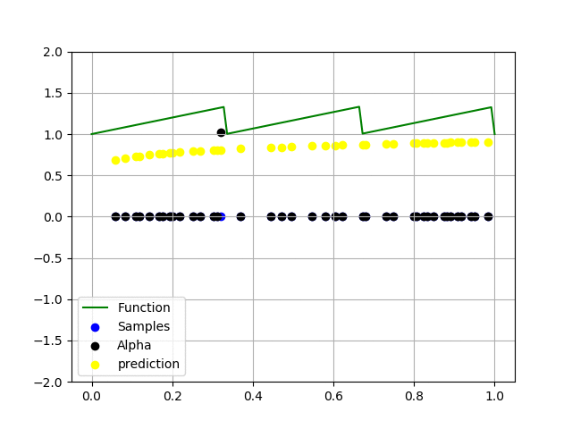

# Comparison of SAG and SDCA method on classification (SVM) and regresion (Ridge).

<table style="width:100%; table-layout:fixed;">
	<tr>
		<td></td>
		<td></td>
	</tr>
	<tr>
		<td>SAG classification</td>
		<td>SDCA classification with gaussian kernel</td>
	</tr>
	<tr>
		<td></td>
		<td></td>
		<td></td>
	</tr>
	<tr>
		<td>SAG regression</td>
		<td>SAG regression with polynomial kernel</td>
		<td>SAG regression with gaussian kernel</td>
	</tr>
</table>